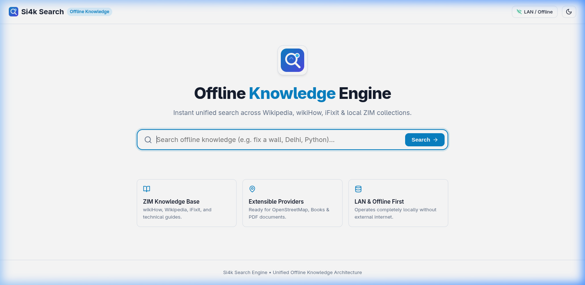
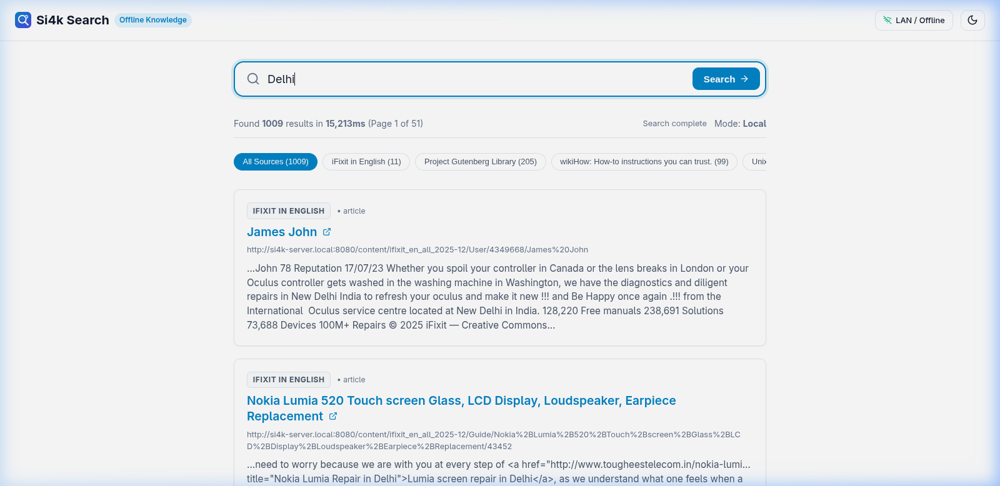
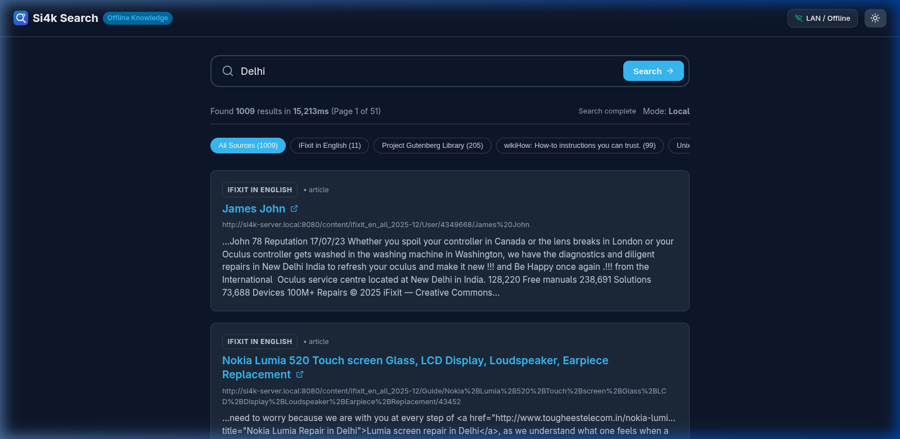

# Si4k Search Engine `v0.0.1`

 

Unified, high-performance offline-first knowledge search engine for Kiwix and local ZIM collections including Wikipedia, wikiHow, iFixit, Stack Overflow, and other datasets. Optimized for modest home servers and offline knowledge infrastructure.

### Screenshots

| Landing & Search View | Real-Time Progressive Stream |
| :---: | :---: |
|  |  |

| Dark Mode Theme |
| :---: |
|  |

---

## Why Si4k?

Kiwix makes offline knowledge available, but large ZIM collections can contain hundreds of independent knowledge sources.

Si4k Search provides a unified search layer across those sources.

Instead of:

```
User ──> one ZIM ──> search
```

Si4k provides:

```
User ──> Si4k Search ──> relevant ZIMs ──> unified results
```

- **Interactive Multi-ZIM Selection (`@`)**: Users can pick one or more specific ZIM files (e.g. `@wikipedia_en_all`, `@wikihow_en_all`) via the `@` popover dropdown or inline `@` triggers. Selected ZIM chips appear above the search bar with hover `x` remove buttons.
- **Category Attachment & Domain Tagging (`#`)**: Dedicated category logic module (`categoryLogic.ts`) for attaching and filtering queries by domain categories (e.g. `#programming`, `#linux`, `#medicine`, `#guides`, `#repair`, `#cooking`, `#history`).
- **Priority-Aware Search**: Dynamically routes queries to intent-matched ZIM sources first (e.g., ArchWiki for Linux setup queries, Stack Overflow for coding questions).
- **Progressive Results**: Streams search matches to the user in real-time over SSE as individual ZIM sources complete.
- **Full-Library Traversal**: Never terminates early or restricts total candidate search scope — continues traversing the entire library to guarantee deterministic completeness.
- **Unified Pagination & Ranking**: Interleaves and re-ranks articles from multiple ZIMs using keyword frequency, category match, and source priority.
- **LAN-Only Remote Configuration**: Real-time `.env` inspection and editing API (`GET /api/config`, `POST /api/config`) with in-memory hot patching for local network administrators.
- **Modest Hardware Optimization**: Designed to run efficiently on low-resource home servers (such as older Intel i5 5th-Gen servers).
- **Configurable Deployment**: Easy to deploy via Docker, Docker Compose, or standalone Node.js daemon.

---

## Architecture Overview

```
                         ┌─────────────────┐
                         │   User Query    │
                         └────────┬────────┘
                                  │
                                  ▼
                       ┌─────────────────────┐
                       │ Query / Intent      │
                       │ Classification      │
                       └─────────┬───────────┘
                                 │
                    ┌────────────┴────────────┐
                    ▼                         ▼
              Priority Sources          Remaining Sources
                    │                         │
                    └────────────┬────────────┘
                                 ▼
                       ┌──────────────────┐
                       │ Kiwix Providers  │
                       └────────┬─────────┘
                                │
                                ▼
                       ┌──────────────────┐
                       │ Result Mixer     │
                       │ + Ranking        │
                       └────────┬─────────┘
                                │
                                ▼
                       ┌──────────────────┐
                       │ Progressive SSE  │
                       └────────┬─────────┘
                                │
                                ▼
                         Search Results
```

### Key Components

- **Two-Wave Priority Search Model**:
  - **Wave 1**: Searches high-relevance prioritized ZIM sources.
  - **Wave 2**: Continues searching remaining eligible ZIM sources until the configured search scope is exhausted or the search is cancelled.
  - Priority determines search order, **never search scope**.
- **Progressive SSE Result Streaming**:
  - Emits progressive result batches over Server-Sent Events (SSE) as ZIM sources complete.
  - Real-time client rendering with monotonic execution time tracking (`executionTimeMs`).
- **Multi-ZIM Index Mixing**:
  - When 1 or more ZIM files are selected via `@`, candidate results are inter-leaved and re-ranked across the selected ZIMs.
- **User-Configurable LRU Search Cache**:
  - Deterministic caching controlled via `.env` (`SEARCH_CACHE_ENABLED`, `SEARCH_CACHE_TTL_SECONDS`, `SEARCH_CACHE_MAX_ENTRIES`).
  - Only complete search sessions enter the cache to prevent partial result pollution.
- **Server Concurrency Valve & Resource Protection**:
  - Queue-backed concurrency controls (`SEARCH_MAX_CONCURRENT=2`, `SEARCH_MAX_ZIM_WORKERS=4`, `SEARCH_REQUEST_TIMEOUT_MS=10000`).
  - Automatic `AbortSignal` propagation cancels worker HTTP fetches when clients disconnect.
- **Offline-first & Self-Contained UI**:
  - Standalone inline SVG logo (`Si4kIcon`), inline SVG favicon, zero external network fonts/CDNs, and native system font stack.

---

## Quick Start with Docker

### Option A: Complete Docker Compose Stack (Si4k Search + Kiwix Server)

If you have ZIM datasets located on your host machine (e.g., at `/mnt/knowledge`), run:

```bash
docker compose up -d
```

Si4k Search will be accessible at `http://localhost:3000`.

### Option B: Connecting Si4k Search to an Existing Kiwix Server

If you already have `kiwix-serve` running on your local network (e.g., at `http://192.168.1.100:8080`):

```bash
docker run -d \
  --name si4k-search \
  -p 3000:3000 \
  -e NODE_ENV=production \
  -e KIWIX_LOCAL_URL=http://192.168.1.100:8080 \
  -e KIWIX_LOCAL_PUBLIC_URL=http://192.168.1.100:8080 \
  -e KIWIX_DATA_DIR=/knowledge \
  -e KIWIX_LIBRARY_XML=/knowledge/Metadata/library.xml \
  -v /mnt/knowledge:/knowledge:ro \
  si4k-search:latest
```

### Docker Build Requirements

The Docker image does not require a running Kiwix server during build.

If the Kiwix catalog is unavailable while building, Si4k Search preserves the prebuilt ZIM index included with the repository. Kiwix connectivity is configured at runtime through `KIWIX_URL`.

For Docker Compose, the default is:

`http://kiwix:8080`

This allows the image to be built independently of the host's Kiwix installation or private network.

---

## Performance & Benchmarks

In current development benchmarks, Si4k Search remained around **160–230 MB RSS** memory under the tested workloads. Actual usage depends on query volume, ZIM count, concurrency, and configuration.

### Development Benchmark Summary

| Workload / Metric | Result |
| :--- | ---: |
| **ZIM sources searched** | 127 ZIM collections |
| **Concurrent search sessions** | 2 |
| **ZIM workers / search** | 4 |
| **Peak Node RSS Memory** | ~230 MB |
| **1 Uncached Search (Full Library Traversal)** | ~25 s |
| **10 Concurrent Requests** | 0 failures / timeouts |
| **Sustained Memory Leak Test (20 searches)** | No memory growth observed |

*Note: Benchmarks were performed on the development host. Target-server performance will vary by hardware, storage, network, and ZIM configuration.*

---

## Environment Variables

| Variable | Default Value | Description |
| :--- | :--- | :--- |
| `PORT` | `3000` | HTTP port exposed by Express server |
| `NODE_ENV` | `development` | Application execution mode (`production` / `development`) |
| `ENVIRONMENT_OVERRIDE` | `auto` | Force environment detection (`auto`, `local`, or `internet`) |
| `LOCAL_NETWORKS` | `192.168.0.0/16,10.0.0.0/8...` | Comma-separated CIDR blocks considered local LAN connections |
| `KIWIX_LOCAL_URL` | `http://kiwix:8080` | Internal backend URL used by Node process to query Kiwix on LAN (fallback: `KIWIX_URL`) |
| `KIWIX_LOCAL_PUBLIC_URL` | `http://si4k-server.local:8080` | Public-facing target URL used by LAN users for article links (fallback: `KIWIX_PUBLIC_URL`) |
| `KIWIX_ONLINE_URL` | `http://kiwix:8080` | Internal backend URL used by Node process when in online mode |
| `KIWIX_ONLINE_PUBLIC_URL` | `https://wiki.si4k.online` | Target URL used by internet users to open Kiwix articles |
| `KIWIX_DATA_DIR` | `/mnt/knowledge` | Path to host-mounted knowledge library root directory |
| `KIWIX_LIBRARY_XML` | `/mnt/knowledge/Metadata/library.xml` | Path to host-mounted Kiwix `library.xml` metadata file |
| `KIWIX_CANDIDATE_LIMIT` | `100` | Maximum candidate search matches fetched per ZIM source per request |
| `KIWIX_MAX_SEARCH_SOURCES` | `unset` (unlimited) | Maximum ZIM sources to query per request after relevance ranking (fallback: `SEARCH_MAX_SOURCES`) |
| `MAX_CONCURRENT_ZIM_SEARCHES` | `8` | Maximum parallel HTTP fetch calls across active ZIM sources per provider |
| `KIWIX_CACHE_TTL_SECONDS` | `300` | Periodic runtime ZIM catalog discovery and index refresh interval in seconds (fallback: `ZIM_CACHE_TTL_SECONDS`) |
| `SEARCH_KEYWORD_WEIGHT` | `10` | Multiplier applied to keyword match relevance scoring |
| `SEARCH_BASE_PRIORITY_WEIGHT` | `1` | Multiplier applied to source base priority scoring |
| `SEARCH_MIN_SOURCE_SCORE` | `5` | Minimum relevance score for a ZIM source to be included in search dispatch |
| `SEARCH_MAX_CONCURRENT` | `2` | Maximum concurrent progressive search sessions running in backend |
| `SEARCH_MAX_ZIM_WORKERS` | `4` | Maximum parallel ZIM worker fetches per search session |
| `SEARCH_REQUEST_TIMEOUT_MS` | `10000` | Maximum HTTP request timeout in ms for individual Kiwix ZIM fetches |
| `SEARCH_MAX_MIXED_RESULTS` | `500` | Maximum candidate articles kept after cross-ZIM mixing |
| `SEARCH_MIN_SOURCES_BEFORE_STREAM_MIX` | `1` | Number of ZIM sources completed before emitting progressive stream mix |
| `SEARCH_CACHE_ENABLED` | `true` | Enable/disable deterministic search result caching |
| `SEARCH_CACHE_TTL_SECONDS` | `300` | Time-to-live for cached search queries (in seconds) |
| `SEARCH_CACHE_MAX_ENTRIES` | `100` | Maximum entries retained in LRU cache |
| `SEARCH_CACHE_DEBUG` | `false` | Enable verbose LRU cache hit/miss/eviction logging |

### Search Scope & Concurrency Tuning

- **`KIWIX_MAX_SEARCH_SOURCES`** (default: `unset` / unlimited):
  Limits how many ZIM sources are searched for a single query.
  - **Dynamic Query-Based Selection**: This is a **maximum cap**, not a hardcoded list of sources. For each query, Si4k scores and ranks all available ZIM sources using keyword and category relevance matching, then dispatches search requests to the top $N$ highest-ranked sources for that specific query.
  - **Query-Dependent Matching**: A query like `linux terminal` prioritizes Linux and shell ZIMs, while `react hooks` prioritizes programming and web development ZIMs.
  - **Recall vs. Latency Tradeoff**: Higher values (or leaving it unset) search more ZIM sources, maximizing recall across large libraries, but take longer and increase server network/CPU load. Lower values (e.g. `KIWIX_MAX_SEARCH_SOURCES=5`) restrict search scope to the top 5 most relevant sources, drastically improving response times and reducing load on modest home servers.
  - **Automatic Fallback**: If the query has fewer relevant sources than $N$, all available relevant sources are searched without truncation.
  - **Example**:
    ```bash
    KIWIX_MAX_SEARCH_SOURCES=5
    ```

- **`MAX_CONCURRENT_ZIM_SEARCHES`** (default: `8`):
  Maximum parallel HTTP fetches executed simultaneously per provider. Prevents socket exhaustion when querying large source lists.

- **`SEARCH_MAX_ZIM_WORKERS`** (default: `4`):
  Maximum parallel ZIM worker tasks executed per search session.

- **`KIWIX_CACHE_TTL_SECONDS`** (default: `300`):
  Interval in seconds for periodic runtime ZIM catalog discovery and index reconciliation.

---

## API Endpoints & Health Checks

- **ZIM Discovery & Categories Endpoint**:
  ```bash
  curl http://localhost:3000/api/zims
  ```
  Returns available ZIM sources and distinct categories.

- **Progressive Stream Endpoint**:
  ```bash
  curl "http://localhost:3000/api/search/stream?q=fever&zims=medlineplus_en_all_2025-01&categories=medicine"
  ```
  Streams real-time result batches over SSE filtered by specified ZIMs and categories.

- **Configuration API (LAN Only)**:
  - `GET /api/config` - Fetch current whitelisted `.env` parameters.
  - `POST /api/config` - Update `.env` parameters with in-memory hot-patching.

- **Service Liveness Endpoint**:
  ```bash
  curl http://localhost:3000/api/health
  ```
  Returns `200 OK`:
  ```json
  {
    "status": "ok",
    "service": "si4k-search"
  }
  ```
  *Note: `/api/health` does NOT fail if Kiwix is temporarily offline.*

- **Kiwix Readiness Endpoint**:
  ```bash
  curl http://localhost:3000/api/health/ready
  ```
  Returns `200 OK` when Kiwix is reachable (`"kiwix": "reachable"`), or `503 Service Unavailable` when Kiwix is offline (`"kiwix": "unreachable"`).

---

## Mounting ZIM Library & External Kiwix Setup

### Mounting Host Knowledge Directory

ZIM knowledge libraries can be hundreds of gigabytes in size. **Do not copy ZIM files into Docker images.** Mount your host knowledge directory into the container:

```yaml
volumes:
  - /mnt/knowledge:/knowledge:ro
```

Expected directory layout on host:

```
/mnt/knowledge/
├── Metadata/
│   └── library.xml
└── ZIM/
    ├── wikipedia_en_all_maxi.zim
    ├── wikihow_en_maxi.zim
    └── archlinux_en_all_maxi.zim
```

---

## Graceful Shutdown

During container shutdown or restarting (`docker stop` or `docker compose down`), Node.js catches `SIGTERM` and `SIGINT`:
1. Express stops accepting new HTTP connections.
2. Active search sessions and SSE streams are cleanly aborted/closed.
3. Process exits with code 0.

---

## Local Development & Manual Testing

### Building Locally

```bash
npm install
npm run build
```

### Running Automated Test Suite

```bash
npx tsc --noEmit && npm test
```

### Manual Verification Script

```bash
npx tsx src/server/dockerVerification.test.ts
```

---

## Extensibility & Extension Roadmap

### Core Design Principle
> **Optional capabilities must never become mandatory dependencies of the core search engine.**
>
> Si4k Search operates out of the box as **Search Core + Knowledge Providers**. Additional capabilities (+ Voice, + Translation, + Dictionary, + AI, + Maps) are pluggable extension interfaces that can be activated independently.

### Extension Phases

#### Phase 1: Knowledge Providers (`SearchProvider`)
- Kiwix / ZIM (Wikipedia, wikiHow, iFixit, Stack Overflow, DevDocs)
- Offline Documents (PDF, ePub, Markdown)
- OpenStreetMap / Nominatim location datasets
- Custom structured JSON/XML datasets

#### Phase 2: Local Language Capabilities (`LanguageProvider`)
- Offline language detection
- Downloadable offline dictionaries & term lookup
- Query translation (e.g. English query routed to Hindi ZIMs with cross-lingual unified ranking)
- Multilingual query expansion

```
User Query ──→ Language Detection
                    │
                    ├── original query ──→ English ZIMs ──┐
                    │                                     ├──→ Unified Ranking
                    └── translation ────→ Hindi ZIMs ────┘
```

#### Phase 3: Voice Search (`SpeechToTextProvider`)
- Optional local speech-to-text (STT) provider (`Microphone ──→ Local STT ──→ Search Query`).
- Completely decoupled; core search requires zero voice or STT packages.

#### Phase 4: AI-Assisted Search (`SummaryProvider`)
- Optional grounded summary generation using local LLMs (e.g. Ollama/llama.cpp) or custom AI endpoints.
- Pipeline: `Search ──→ Top N Ranked Results ──→ SummaryProvider ──→ Grounded Summary + Source Citations`.
- Core search remains 100% operational without an AI model.

---

## Troubleshooting

1. **`GET /api/health/ready` returns 503 Service Unavailable**:
   - Check if `KIWIX_URL` matches your Kiwix server address.
   - Verify network accessibility: `curl http://<KIWIX_HOST>:8080/`.
2. **Search results link to unreachable URLs**:
   - Ensure `KIWIX_PUBLIC_URL` matches the address accessible by your client browser.
3. **No ZIM sources discovered**:
   - Verify `KIWIX_LIBRARY_XML` path points to a valid `library.xml` file.

---

## Contributing

Contributions are welcome! Key areas where contributions are particularly useful:

- Search providers (OSM, PDF, EPUB, Structured Datasets)
- Ranking & relevance algorithms
- ZIM discovery & categorization
- Performance & memory optimization
- Multilingual language support & dictionaries
- Local AI / Summary providers
- UI / UX enhancements
- Docker & home-server deployment guides

---

## License

Si4k Search is open-source software licensed under the [MIT License](LICENSE).

*Note: Individual ZIM datasets, books, and articles indexed by Kiwix may have their own licenses and redistribution terms. Check the license of each specific dataset before redistributing ZIM files.*
